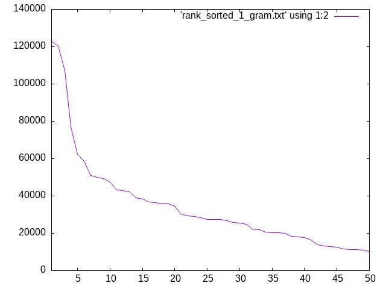

# データ収集

配列を作成するにあたり作成者の「カン」というのは大事だが (というか、最終的にはカン頼みになってしまうのが配列作成の現状だと思う)、やみくもに配列を決めても効果的な配列が生まれる可能性は低いと思う。やはりカンに頼る前に、なんらかの仮説のようなものを立てるためのデータは必要だろう。新下駄配列の作成時にも行われたことだが、私も N-gram のデータが重要になってくると考える。

## N-gram 生成のために使用するデータ

ここで必要なデータというのは、以下のような特性を持ったものだ:

* 色々な分野から得られた、ある程度バランスの取れたデータである
* 読みの情報が入っているデータである (必ずしも必要ではないが、その場合私の手で mecab などを介して読み情報を作成する必要がある)
* できれば人間の手で作られた、または人間のチェックが入ったデータである
    * これは mecab などの読み情報の出力で一部不完全と思えるような箇所を見つけたため -- 実は公開されている新下駄配列作成のために使われたデータにもそのような (誤った読み方と思えるような内容を見つけている)
* ある程度のデータ量がある -- 新下駄配列では百万という数値があったが、私もこれぐらいが最低限必要だろうと考える

少し調べてみたのだが、以下にある京都大学のページからダウンロード可能な BCCWJ(コアデータ) をベースにした仮名漢字変換用の N-gram を使うことにする。

http://www.lsta.media.kyoto-u.ac.jp/member/gologo/lm.html

リンク切れを起こしたときのために Archive.org 以下の URL も書いておく。
* https://web.archive.org/web/*/http://www.lsta.media.kyoto-u.ac.jp/member/gologo/lm.html -- 上記のページ
* https://web.archive.org/web/*/http://www.lsta.media.kyoto-u.ac.jp/member/gologo/kkc-BCCWJCore.tar -- BCCWJ (コアデータ) の仮名漢字変換用

理由は以下の通り:

* 読み情報が与えられている
* 元々 BCCWJ のデータは (B が Balance を表しているように) 色々な分野のテキストデータから作成されたデータである
* BCCWJ のコアデータは人力でアノテーションが行われたらしい -- この人力入力が読み情報に対しても行われたかは論文からは明らかではないが、meacb などで "二十日/にじゅうにち" となるところ、このデータではちゃんと "二十日/はつか" と表記されている
* 文字レベルではなく単語レベルで tokenization は行われているが、これは私の後処理で対処できそう
* 単語数だけで 100 万トークンある (文字ベースだと更にある)

ファイルをダウンロードして、`bz2` ファイルを `bunzip2` にて解凍した後、以下のようにして utf-8 に変換する:

```
iconv 1-gram.fwk -f EUC-JP -t UTF8 -o utf-1gram.txt
```

## データの後処理

ここから今回の目的のために色々な後処理をしていくことになる。

### 拗音文字から始まるデータの削除

後々出てくる話だが、この配列では拗音文字はその前に来る文字とセットで打つことを想定している (勿論拗音文字だけ入力することもできるようにするつもりだが、それはどちらかと言うと救済措置的な意味合いが強い)。従って N-gram の内容も拗音セットを一つのトークンとして扱うのが望ましい。以下にあるように、拗音文字から始まるトークンというのは極めてまれと見ることができるので、そのようなデータは削除 (というか無視) することにする。

```
egrep '/(ゃ|ゅ|ょ|ぁ|ぃ|ぅ|ぇ|ぉ|ゎ)' utf-1gram.txt
     4 ゃ/ゃ
     2 ょ/ょ
     1 ィ/ぃ
     1 ぇ/ぇ
     1 いりゃ/ゃ
```

UPDATE: 結局拗音セットを一つのまとまりとして打つと、大多数の人類が対応できないような数の配置 (とさらなるシフト面) を用意しなければならなくなってしまうので、拗音文字を一つの文字として扱うことにしました。従ってこのセクションの内容は無視されます (実装はしましたがコメントアウトしました)。

### BT への変換

上のページでは

```
N-gram の文頭、文末を表す特殊な記号を BT としています。
1 回しか出現していないものを未知語を表す特殊な記号 UNK と置換しています。
```

という記述があるのだけれど、データを見た限りでは両方 `BT` として記述されているように見える。それ自体は特に問題ではないのだけれど、データの中には以下のような、

```
■/しかく
```

…私なら `記号` とでも入力して変換しそうな文字にも読みが与えられている。このようなデータの読み情報(上の例ならば `しかく` を N-Gram のデータに加えると、タイピングではあまり使わない文字が重要な文字として見えてしまう可能性がある。このような混乱を避けるために、読み情報を取り出す前に、このようなトークンを `BT` と変換しておく (ちなみにまだ `BT` とはなんの略なのかよく分かっていない)。

### 連続した BT トークンを一つとして見なす

特に説明はいらないと思う。

### 単語ベースから文字ベースへの N-Gram 変換

上にも書いた通り、ここで得られるファイルの中身は単語ベースの N-gram である。これを文字ベースに変換する必要がある。

与えられたファイルの形式というのは

```
N( A/B)+
```

というもので、`N` が出現する頻度を表し、`A` がその単語の表記、`B` が読みを表す。ここで例えば

```
100 今日/きょう 私/わたし は/は
```

というデータが与えられた場合、以下のように N-gram が計算されなおされる

```
100 きょ う わ
100 う わ た
100 わ た し
100 た し は
```

ちなみに元々のデータが tri-gram だった場合、変換後のデータも tri-gram として扱おうと考えている。

## 実装

以下のようにスクリプトを走らせることで、データの後処理を行うことができる:

```
python n_gram_conversion.py -n 2 utf-2gram.txt
```

## データを覗いてみる

後々 N-gram ファイルの中にある数値を見た時の感覚を養うために、今のうちからどれぐらいの頻度の n-gram トークンがどれほどのランクにあるのか可視化しておく。

例えば以下のような方法でグラフを生成することができる:

```
cat sorted_7_gram.txt | awk -F '\t' '{print $1}' | cat -n > rank_7gram
for i in 50 100 500 100 2000 3000 4000 5000; do echo "set terminal jpeg; set xrange[1:${i}]; set output 'rank_occur_7gram_${i}.jpg'; plot 'rank_7gram' using 1:2 with lines" | gnuplot -p; done
```

出来上がったファイルは例えば以下のようなものである:



ファイルは以下のディレクトリに収められている:

[images](images)


